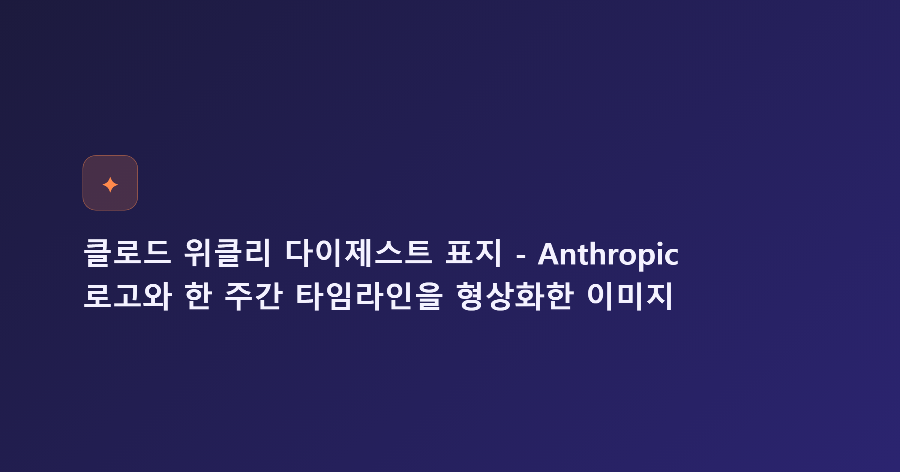

# 클로드(Claude) 주간 다이제스트: 7월 1주차를 관통한 3가지 흐름

이번 한 주(7월 4일~10일) Anthropic과 Claude 진영 소식을 한 번에 정리하면 어떤 그림이 그려질까요? 결론부터 말씀드리면 "신뢰·안정성·실무 확산"이라는 세 갈래로 요약됩니다. 이사회 소식, 정부 기관 도입 사례, 그리고 쉼 없이 이어진 Claude Code 패치까지, 이번 주에 흩어져 있던 소식들을 한 편으로 모아 정리했습니다.

## 첫 번째 흐름: 신뢰를 쌓으려는 지배구조 발표

7월 9일 하루에 신뢰와 투명성에 관한 소식이 한꺼번에 나왔습니다. Anthropic은 벤 버냉키(Ben Bernanke)를 장기수혜신탁(Long-Term Benefit Trust) 이사로 새로 임명했다고 밝혔고, 같은 날 AI를 둘러싼 어려운 질문에 대중의 의견을 구하겠다는 "Inviting hard questions" 성명도 함께 공개했습니다. 여기에 사용자가 자신의 Claude 사용 방식을 되돌아볼 수 있는 성찰 기능 소개까지 더해졌으니, 발표 시점이 겹친 것 자체가 이번 주의 성격을 보여주는 신호였다고 볼 수 있습니다.

## 두 번째 흐름: 거의 매일 이어진 Claude Code 안정화 패치

이번 주 가장 눈에 띄는 변화는 역시 Claude Code였습니다. 7월 3일 v2.1.201부터 7월 9일 v2.1.206까지 거의 매일 새 버전이 올라왔는데, 방향은 새 기능 추가보다 안정성 다지기에 가까웠습니다. `/cd` 명령의 경로 자동완성, `/doctor`의 CLAUDE.md 최적화 제안, `/commit-push-pr`의 git push 원격 설정 자동 허용처럼 편의성을 높이는 항목도 있었지만, 세션 트랜스크립트 변조 방지, 백그라운드 세션 토큰 만료 문제 수정, 워크트리 삭제 버그 수정 등 안정성 관련 패치가 더 많은 비중을 차지했습니다. 지난 6/22~26 다이제스트에서 다뤘던 `claude mcp login/logout`, `/rewind` 기능도 이번 주 실무에서 여전히 자주 언급되는 흐름으로 이어지고 있습니다.

## 세 번째 흐름: 문서 작업을 넘어선 실무 확산

7월 6일에는 캐나다 앨버타 주정부가 Claude를 활용해 정부 시스템 전반의 사이버보안 취약점을 찾아 수정한 사례가 알려졌습니다. 보안 점검처럼 민감한 공공 업무에까지 Claude가 실제로 투입됐다는 점에서, 이 사례는 활용 범위가 문서 작성을 넘어 인프라 보안 영역까지 넓어지고 있다는 것을 보여주는 증거로 읽힙니다.

## 세 흐름의 배경: 지난주 발표가 남긴 여진

이번 주 소식들의 배경에는 지난주 말(6월 30일) 공개된 Claude Sonnet 5, Fable 5·Mythos 5의 전 세계 재배포, 그리고 연구자용 AI 워크벤치 Claude Science가 자리하고 있습니다. 특히 7월 2일에는 Fable 5의 사이버 안전장치와 jailbreak 심각도 평가 프레임워크에 대한 세부사항이 추가로 공개됐는데, 이는 Amazon·Microsoft·Google 등과 함께 제안한 업계 최초의 공동 평가 체계라는 점에서 의미가 있습니다. 새 모델을 내놓는 데 그치지 않고 안전장치를 계속 다듬어가는 모습이, 이번 주 신뢰·안정성 소식들과 자연스럽게 맞닿아 있는 셈입니다.

## 그 밖에 짚어볼 소식

6월 23일 공개된 팀 협업 기능 Claude Tag도 여전히 참고할 만한 소식입니다. 다만 Anthropic의 서울 오피스 개설 소식은 한 자료에서만 언급됐을 뿐, 이번 주 뉴스룸에서는 다시 확인되지 않았습니다. 최신순 목록에서 밀려났을 가능성도 있는 만큼, 사실 여부는 조금 더 지켜볼 필요가 있어 보입니다.

## 한 주를 세 줄로 정리하면

이번 주 Anthropic과 Claude 소식은 "신뢰를 쌓고, 안정성을 다지고, 실무에 스며드는 한 주"였습니다. 버냉키 이사 선임과 투명성 성명이 신뢰의 영역을, 거의 매일 이어진 Claude Code 패치가 안정성의 영역을, 앨버타 주정부의 도입 사례가 실무 확산의 영역을 각각 대표했습니다. 이 세 흐름이 다음 주에는 어떻게 이어질지 계속 지켜볼 만합니다.

---

#Claude #Anthropic #클로드 #ClaudeCode #클로드코드 #ClaudeSonnet5 #Fable5 #ClaudeScience #AI소식 #인공지능뉴스 #벤버냉키 #LongTermBenefitTrust #AI거버넌스 #AI안전성 #jailbreak프레임워크 #앨버타주정부 #AI도입사례 #ClaudeTag #생성형AI #AI위클리다이제스트
