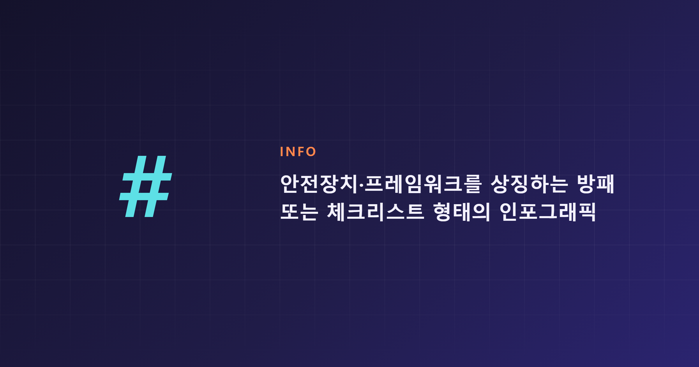

# 클로드(Claude) 이번 주 소식 정리: 버냉키 이사 선임부터 코드 업데이트 6가지까지

이번 주(7월 3일~10일) Anthropic과 Claude 진영에서는 어떤 일이 있었을까요? 새 이사 선임 같은 지배구조 소식부터 정부 기관의 실제 도입 사례, 그리고 거의 매일 이어진 Claude Code 패치까지 한 주 동안 꽤 많은 변화가 있었습니다. 검색하다 지치신 분들을 위해 이번 주 핵심만 소제목별로 정리했습니다.

## 지배구조·투명성 관련 발표

7월 9일 Anthropic은 벤 버냉키(Ben Bernanke)를 장기수혜신탁(Long-Term Benefit Trust) 이사로 임명했다고 밝혔습니다. 같은 날 AI를 둘러싼 어려운 질문에 대해 대중의 의견을 구하고 투명성을 지키겠다는 "Inviting hard questions" 성명도 함께 나왔고, 사용자가 자신의 Claude 사용 방식을 되돌아볼 수 있는 새로운 성찰 기능도 소개됐습니다. 세 소식 모두 발표 시점이 겹치는 걸 보면, 이번 주는 Anthropic이 신뢰와 투명성이라는 키워드를 유독 강조한 한 주였다고 볼 수 있습니다.

## 실제 도입 사례: 앨버타 주정부의 사이버보안

7월 6일에는 캐나다 앨버타 주정부가 Claude를 활용해 정부 시스템 전반의 사이버보안 취약점을 찾아 수정한 사례가 공개됐습니다. 공공기관이 보안 점검처럼 민감한 업무에까지 Claude를 실무에 투입했다는 점에서, 이번 사례는 Claude의 활용 범위가 문서 작업을 넘어 인프라 보안 영역까지 넓어지고 있음을 보여줍니다.

## Claude Code, 이번 주도 거의 매일 업데이트

Claude Code는 7월 3일 v2.1.201부터 7월 9일 v2.1.206까지 거의 매일 패치가 올라왔습니다. `/cd` 명령의 경로 자동완성, `/doctor`의 CLAUDE.md 최적화 제안, `/commit-push-pr`의 git push 원격 설정 자동 허용 같은 편의 기능이 추가됐고, 세션 트랜스크립트 변조 방지, 백그라운드 세션 토큰 만료 문제, 워크트리 삭제 버그 등 안정성 관련 수정도 다수 포함됐습니다. 6/22~26 주간 다이제스트에서 소개된 `claude mcp login/logout`, `/rewind` 같은 기능도 여전히 실무에서 자주 언급되는 흐름입니다. 정리하면 이번 주 Claude Code는 새 기능 추가보다 로그인·권한·백그라운드 세션의 안정성을 다지는 데 무게를 둔 한 주였습니다.

## Fable 5 재배포와 안전장치, 그 배경이 된 지난주 발표들

지난주 말(6월 30일) 공개된 Claude Sonnet 5, Fable 5·Mythos 5의 전 세계 재배포, 그리고 연구자용 AI 워크벤치 Claude Science는 이번 주 뉴스에서도 계속 배경으로 언급되고 있습니다. 특히 7월 2일에는 Fable 5의 사이버 안전장치와 jailbreak 심각도 평가 프레임워크에 대한 추가 세부사항이 공개됐는데, 이는 Amazon·Microsoft·Google 등과 함께 제안한 업계 최초의 공동 평가 체계라는 점에서 의미가 있습니다. 새 모델을 내놓는 데 그치지 않고 안전 프레임워크를 공개적으로 다듬어가는 모습이, 이번 주 소식들을 관통하는 공통된 흐름이라 할 수 있습니다.

## 그 밖에 눈에 띄는 소식

6월 23일에는 팀 협업을 위한 새로운 방식의 기능인 Claude Tag가 공개된 바 있습니다. 한편 Anthropic의 서울 오피스 개설 소식은 한 자료에서는 언급됐지만, 이번 주 뉴스룸을 다시 확인했을 때는 해당 항목이 눈에 띄지 않았습니다. 오래된 소식이 최신순 목록에서 밀려났을 가능성이 있어 보이는 만큼, 정확한 사실 여부는 조금 더 지켜볼 필요가 있어 보입니다.

## 한 주를 정리하며

이번 주 Anthropic과 Claude 소식을 한 줄로 요약하면 "신뢰를 쌓고, 안정성을 다지고, 실무에 스며드는 한 주"였습니다. 버냉키 이사 선임과 투명성 성명이 신뢰의 영역이었다면, Claude Code의 잦은 패치는 안정성의 영역이었고, 앨버타 주정부의 도입 사례는 실무 확산의 영역이었습니다. 다음 주에는 이 세 흐름이 어떤 식으로 이어질지 지켜볼 만합니다.

---

#Claude #Anthropic #ClaudeCode #ClaudeSonnet5 #Fable5 #ClaudeScience #AI소식 #인공지능뉴스 #벤버냉키 #LongTermBenefitTrust #클로드코드업데이트 #AI거버넌스 #AI안전성 #jailbreak프레임워크 #앨버타주정부 #AI도입사례 #ClaudeTag #생성형AI #AI위클리 #테크뉴스
